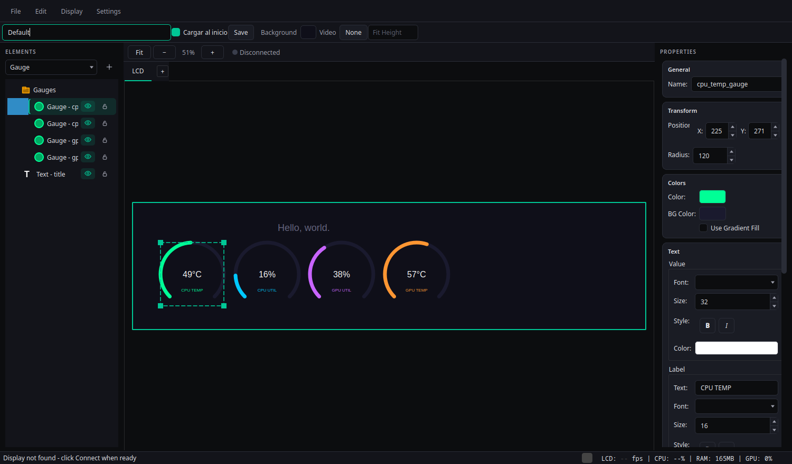
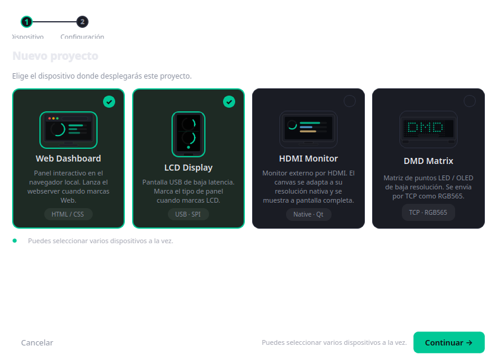
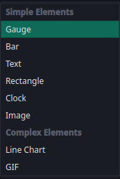
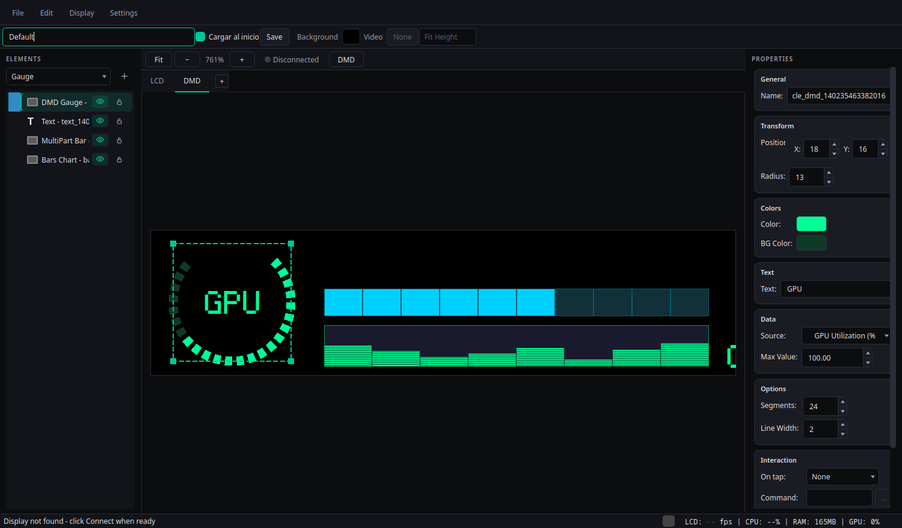
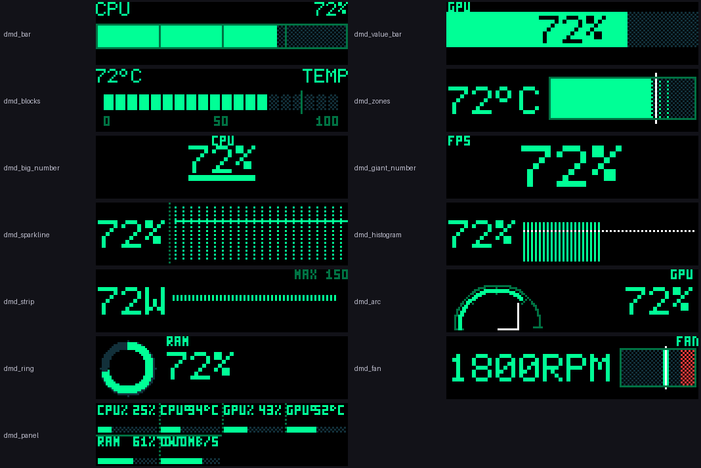

# Thermal Engine Studio

**🇪🇸 Español** · [🇬🇧 English](#english)

Editor visual de temas para pantallas de monitorización: LCD USB (refrigeración AIO), paneles LED **DMD** (ESP32), monitores **HDMI** y **preview web**. Diseñas el tema con un lienzo visual y Thermal Engine Studio lo renderiza en tiempo real con datos de sensores del sistema.

---

## Español

### ¿Qué es?

Thermal Engine Studio es una aplicación de escritorio (Python + Qt/PySide6) para crear y desplegar temas de monitorización. Un **proyecto** puede tener varios **destinos** a la vez y el mismo editor sirve para todos:

| Destino | Salida |
|---|---|
| **LCD** | Pantalla LCD por USB (driver LY *bulk* o HID), p. ej. Thermalright Trofeo Vision. |
| **DMD** | Panel LED *Dot Matrix* ESP32 por TCP (frames RGB565). |
| **HDMI** | Monitor externo a pantalla completa, a su resolución nativa. |
| **Web** | Servidor local bajo demanda con la imagen renderizada y panel de control. |

### Capturas



| Asistente *New Project* | Combo de elementos (Simple / Complex) |
|---|---|
|  |  |

### Características principales

- **Proyectos multi-destino** con asistente **New Project…** (dispositivo → configuración) y opción de **añadir dispositivos** a un proyecto existente. Los destinos DMD y HDMI tienen **switch On/Off** para pausar/reanudar su salida sin salir del editor; el menú **Display** lista cada dispositivo activo con su propio *frame rate*.
- **Editor visual**: lienzo con **zoom** (rueda del ratón, 5 %–400 %), *smart guides* con ajuste, **deshacer/rehacer**, selección múltiple, **agrupación**, **alineación**, y **ocultar/bloquear** elementos.
- **Biblioteca de elementos** organizada en *Simple*, *Complex* y *LCD*, más elementos personalizables:
  - **Simple**: Gauge, Bar, Text, Rectangle, Clock, Image, Video, Icon.
  - **Complex**: Line Chart, GIF, DMD Gauge, MultiPart Bar, Bars Chart.
  - **LCD**: Ring Gauge (arco completo con gradiente y extremos redondeados), Segmented Bar, Zone Bar (zonas con marcador), Stat Tile, Sparkline, Level Bar, Column Chart y **Disk** (icono de HDD con used/free/total, read/write y barra de espacio) (alta resolución, antialiased).
- **Pestaña Widgets**: inserta *resúmenes* (CPU, GPU, RAM, Network, Storage, System) como **grupos editables** de elementos con colocación automática. Cada widget resume las métricas clave con anillos, zonas y tendencias; se guarda como cualquier otro grupo.
- **Pestaña Icons**: galería de iconos empaquetados (`icons/`: cpu, gpu, ram, hdd, ssd, motherboard, psu, fan, network, usb, monitor, keyboard, mouse, en dos estilos). Al hacer clic se añade un elemento **Icon** al canvas (sin selector de fichero), con escala proporcional y **tinte** opcional por color.
- **Web y HDMI táctil**: el webserver sirve la fuente elegida (**LCD/HDMI/Auto**); el HDMI admite **pantallas con transiciones** (por tiempo o por toque) y un widget de **navegación táctil**. Los proyectos **solo-Web** pueden usar un **canvas custom**.
- **Propiedades por elemento**: origen de datos, valor/máximo, colores y opacidad, gradientes, fuentes, bordes, esquinas redondeadas, grosor de línea, segmentos, separación, animación suave y cambio de color por umbrales. Fuente por defecto **Liberation Mono** (en DMD, **Tiny5**).
- **Fuentes de datos**: CPU (uso, temperatura, frecuencia, potencia), GPU (uso, temperatura, frecuencia, memoria, potencia), RAM y red, además de valores estáticos.
- **Rendimiento**: caché por *firma de frame* (reutiliza el JPEG si nada relevante cambia), modo **Overdrive** con hilo de renderizado en segundo plano y objetivo de **FPS** configurable.
- **Ajuste de imagen**: corrección de **brillo, contraste y saturación** del panel, y **modo vertical** (rota la vista y la salida para paneles montados girados 90°).
- **Presets y plantillas**: incluidos *Default* y plantillas horizontales/verticales; guarda el tema actual como preset con miniatura.
- **Integración de escritorio**: tema oscuro, bandeja del sistema, autoarranque, consola de depuración y preferencias persistentes en `settings.json`.

### Destinos de salida

#### LCD (USB)

- Catálogo de paneles en `lcds.py` (resolución nativa, tasas base y extendidas).
- Driver **LY** por USB *bulk* (`device_ly.py`) y ruta alternativa **HID**.
- **Benchmark** manual del panel: si pasa sobre el hardware real, desbloquea las tasas extendidas (30/60 FPS).
- Reconexión automática ante desconexiones/timeouts USB.
- En Linux se incluyen reglas **udev** para acceder al LCD sin `root`.

#### DMD (paneles LED / ESP32)

- Lienzo a resolución DMD nativa: **128×32**, 128×64, 192×64, 256×64 y 320×132.
- Elementos y tipografías pensados para pixel-art (fuentes tipo *Matrix Sans*).
- **13 widgets HWMON·32** para **128×32** con **fuentes bitmap integradas** de **3×5**, **5×7**, **10×14** y **15×21**, en color RGB565 con tramado para estados apagados: barra clásica, valor sobre barra, bloques, zonas con marcador, número grande/gigante, sparkline, histograma, tira de consumo, arco, anillo, aguja de ventilador y **panel combinado** (elige cuántas métricas muestra).
- **Transiciones entre pantallas**: varias pantallas DMD (hasta 8, cada una con su fondo y elementos) en bucle, con **duración por pantalla** y **efecto por transición** (corte, fundido, slide, cortina, dissolve), interruptor *Enable transitions* y previsualización en el editor.
- Envío de frames **RGB565 little-endian** por **TCP** (puerto **8889**), cabecera `AA 55 <ancho> <alto>`, sin ACK (*fire & forget*), desde un hilo dedicado con *backoff*.





El receptor es el firmware del proyecto **[sito1982/RetroPixelLED-ThermalEngine](https://github.com/sito1982/RetroPixelLED-ThermalEngine)**, que implementa el protocolo de **imagen externa** del panel: mientras recibe el *stream* interrumpe los GIFs y pinta los frames al instante; al cesar el envío vuelve solo a la playlist (timeout `IMAGE_TIMEOUT`, por defecto 1000 ms). El toggle **DMD** del editor pausa y reanuda ese *stream*.

#### HDMI

- Salida a pantalla completa en el **monitor seleccionado**, sin bordes ni foco.
- Render a la **resolución nativa** del monitor con **letterbox** centrado si la proporción no coincide.
- Detección de **monitores y hotplug** (al conectar/desconectar se reajusta el canvas).
- El toggle **HDMI** conecta y desconecta la ventana de salida.
- **Pantallas y transiciones** como en DMD: varias pantallas (hasta 8) con duración y efecto por
  transición (corte, fundido, slide, cortina, dissolve), **por tiempo** (switch *Transitions*) o
  **por toque** en monitores táctiles.
- **Interacción táctil**: además de *Run command* (abrir apps), la opción **Screen transition**
  salta a una pantalla concreta. El widget **Touch Navigation** (barra anclada a
  *bottom/top/left/right* con items configurables: pantalla destino, *Next*/*Prev*) permite añadir
  o quitar items y navegar por toque.

#### Web

- Servidor **Flask** que **solo arranca cuando el proyecto tiene destino Web** (ahorro de recursos).
- Sirve la imagen renderizada y un panel de control; puerto configurable (`--port`, por defecto **4241**).
- **Fuente seleccionable** en la pestaña WEB: `Auto` (HDMI si el proyecto la tiene añadida, si no
  LCD), `LCD` o `HDMI`. La pestaña WEB muestra la misma imagen que sirve `/image.jpg`.
- Proyectos **solo-Web** (sin LCD/DMD/HDMI, p. ej. un Lite que solo sirve web): el asistente pide
  una **resolución** (presets o personalizada) y crea un **canvas custom**.
- **Publish to ThermalEngineLite…** vive ahora en la pestaña WEB (botón junto al selector de fuente).

#### Custom

- **Canvas libre** a la resolución que elijas (sin salida física), pensado para Lite/Web.
- Soporta **pantallas y transiciones** (hasta 8, con duración y efecto por transición), igual que DMD/HDMI.
- Se añade desde el asistente (**Custom Canvas**) o con el botón **“+”** de las pestañas.
- **Eliminar canvas**: clic derecho sobre la pestaña de cualquier destino (Web/LCD/DMD/HDMI/Custom)
  para **quitarlo del proyecto** (el diseño guardado no se pierde).

### Elementos LCD y Widgets de resumen

Pensados para el canvas normal (LCD/HDMI, 1920×480 o resolución de monitor), sin la
limitación de resolución del DMD. Se renderizan con antialiasing y gradientes, y la
previsualización del editor coincide exactamente con el frame enviado al panel:

- **Ring Gauge**: anillo de 360° (o 270°), con **gradiente a lo largo del arco**, extremos
  redondeados, valor y etiqueta centrales, *ticks* opcionales.
- **Segmented Bar**: barra por segmentos (horizontal o vertical) con relleno degradado.
- **Zone Bar**: barra con **zonas** (segura/aviso/crítico) y **marcador** de valor.
- **Stat Tile**: bloque de métrica con acento, valor grande y barra de progreso.
- **Sparkline**: tendencia con **relleno degradado** y línea suave.
- **Level Bar**: contenedor que se rellena como una batería.
- **Column Chart**: histograma antialiased con gradiente y línea de objetivo.
- **Disk**: icono de disco duro retro con USED/FREE/TOTAL, READ/WRITE (con mini-tendencias) y barra vertical de espacio (libre/uso).

La pestaña **Widgets** (junto a *Elements*) muestra miniaturas de resúmenes listos para
insertar. Al hacer clic, el widget se añade al canvas activo como **grupo editable** y se
coloca automáticamente en un hueco libre:

- **CPU / GPU**: uso (anillo), temperatura (zona), tendencia (sparkline), potencia, VRAM
  (GPU) y reloj.
- **RAM / Network / Storage / System**: uso y usada/libre, subida/descarga, lectura/escritura
  y ventilador + uptime + NVMe.

### Proyecto Lite (sensores remotos)

Al crear un proyecto (**File → New Project…**) el primer paso permite elegir el tipo:

- **Thermal Engine Studio Project**: flujo habitual (sensores locales y salidas locales).
- **Thermal Engine Lite Project**: el editor se conecta a un equipo que ejecuta
  **ThermalEngineLite** (host/IP, puerto y token) y usa **sus** destinos, dimensiones y
  **sensores en vivo**. Studio no arranca salidas locales en este modo; la pestaña WEB
  muestra el preview del Lite y el tema se envía con el botón **Publish to ThermalEngineLite…** de la pestaña WEB.

Lite debe exponer `GET /info` y `GET /sensors` (token opcional). La URL se guarda en el
tema (bloque `lite`) y el token en `settings.json` (`lite_tokens`), nunca dentro del tema.

### Fuentes de datos (sensores)

| Plataforma | Backend |
|---|---|
| **Windows** | HWiNFO (memoria compartida). |
| **Linux** | `psutil` (CPU/RAM/red), temperaturas/frecuencias y **RAPL**; GPU **NVIDIA** vía NVML (`nvidia-ml-py`) con *fallback* a `nvidia-smi`, y soporte **AMD**. |

La lista de fuentes disponibles se declara en `constants.py` y se agrupa en el selector:
- **CPU / GPU**: uso, temperatura, frecuencia, potencia, VRAM usada.
- **Memoria / Red**: uso/ocupada/disponible y subida/bajada.
- **Ventiladores**: CPU, GPU, sistema y bomba (RPM o %).
- **Rendimiento**: **FPS de juego** (MangoHud en Linux, RTSS vía HWiNFO en Windows).
- **Almacenamiento**: lectura/escritura de disco (MB/s).
- **Sistema**: uptime y temperaturas NVMe/placa base.

### Plugins

Sistema de **plugins de fuentes de datos** (Settings → Plugins…). Un plugin añade fuentes nuevas que cualquier elemento puede usar como `source`; se pueden activar/desactivar, configurar, recargar y **descargar** desde el catálogo del repo.

- **Home Assistant**: expone las entidades numéricas (temperatura, potencia, energía, humedad, batería…) como `ha.<entity_id>`, agrupadas en categorías `HA Temperature`, `HA Power`… Usa un token de larga duración y sondeo con caché.
- **ThermalEngineLite (remoto)**: usa los sensores de un equipo Lite como `lite.<clave>`.
- Los proveedores pueden ser **exclusivos**: al activarse, el selector muestra solo sus fuentes (oculta las del PC). Solo un proveedor exclusivo a la vez.
- Contrato para desarrollar plugins en [`plugins/README.md`](plugins/README.md).

### Presets y plantillas

- El panel de plantillas separa **Horizontal** y **Vertical** según las dimensiones del preset.
- Cada miniatura respeta la proporción real del lienzo.
- Puedes **guardar el tema actual como preset**, con su miniatura PNG.

### Instalación

#### Linux (recomendado: Bazzite / Fedora / distros inmutables)

```bash
git clone <URL-del-repositorio> Thermal-Engine-Studio
cd Thermal-Engine-Studio
./scripts/install-linux.sh
```

El script:

1. Comprueba **Python ≥ 3.10**.
2. Crea un entorno virtual en `.venv/` (no toca el Python del sistema).
3. Instala `requirements.txt` dentro del `.venv` (incluye `pyusb` para el driver LY).
4. Instala las reglas **udev** (`scripts/99-thermalright-trofeo.rules`) y añade tu usuario a `plugdev` si existe.
5. Crea el lanzador de escritorio en `~/.local/share/applications/`.

Tras instalar las reglas udev por primera vez, **reconecta el LCD por USB** (o reinicia). Cierra cualquier software del fabricante (p. ej. TRCC) que pueda bloquear el dispositivo.

Ejecutar:

```bash
./scripts/run-linux.sh
# o directamente:
./.venv/bin/python main.py
```

#### Windows

```bat
scripts\install.bat
scripts\run.bat
```

### Hardware compatible

- **Thermalright Trofeo Vision 9.16** — USB `0416:5408`, protocolo LY (*bulk*)/HID, 1920×480.
- **Paneles DMD / ESP32** con el firmware [RetroPixelLED-ThermalEngine](https://github.com/sito1982/RetroPixelLED-ThermalEngine) (imagen externa RGB565 por TCP :8889).
- **Monitores HDMI** (cualquiera, a resolución nativa).
- **Sensores**: HWiNFO en Windows; `psutil`/RAPL y GPU NVIDIA/AMD en Linux.

### Configuración (`settings.json`)

| Clave | Tipo | Por defecto | Descripción |
|---|---|---|---|
| `launch_at_login` | bool | `true` | Inicia la app al arrancar sesión (Windows: registro; Linux: XDG autostart). |
| `launch_minimized` | bool | `true` | Al iniciar sola, arranca minimizada en la bandeja. |
| `minimize_to_tray` | bool | `true` | Minimizar envía a la bandeja en lugar de a la barra de tareas. |
| `close_to_tray` | bool | `true` | Cerrar la ventana la deja en la bandeja en lugar de salir. |
| `target_fps` | int | `30` | FPS objetivo enviados al panel. |
| `default_preset` | string \| `null` | `null` | Preset que se carga al iniciar. |
| `overdrive_mode` | bool | `false` | Hilo de renderizado en segundo plano para una entrega más fluida. |
| `vertical_mode` | bool | `false` | Rota el diseño y la salida 90° (paneles montados en vertical). |
| `lcd_brightness` | float | `1.0` | Brillo aplicado al frame final (0.5–1.5). |
| `lcd_contrast` | float | `1.15` | Contraste aplicado al frame final (0.5–1.5). |
| `lcd_saturation` | float | `1.25` | Saturación aplicada al frame final (0.5–2.0). |
| `project_targets` | dict | `{web: true, lcd: true, dmd: false, hdmi: false}` | Destinos activos del proyecto. |
| `lcd_model` | string | `"trofeo_9_16"` | Modelo LCD activo del catálogo. |
| `lcd_benchmarks` | dict | `{}` | Resultados del benchmark por panel (`vid:pid`); si pasa, desbloquea tasas extendidas. |
| `dmd_config` | dict \| `null` | `null` | Config del DMD: `{ip, port, width, height, fps, model_id}`. |
| `hdmi_config` | dict \| `null` | `null` | Config del HDMI: `{screen_id, width, height, refresh, connector, scale_mode, fps}`. |
| `web_port` | int | `4241` | Puerto del webserver (también `main.py --port`). |
| `load_at_startup` | bool | `false` | Reabrir el último proyecto al iniciar. |
| `allow_element_actions` | bool | `false` | Permite acciones interactivas en el monitor HDMI (con aprobación). |

Todas las opciones también se ajustan desde la interfaz; los cambios se guardan automáticamente.

### Solución de problemas (Linux)

- **`ModuleNotFoundError: No module named 'usb'`** — `pyusb` no está en el entorno activo: `./.venv/bin/python -m pip install pyusb`.
- **`Failed to connect: open failed`** — reglas udev no instaladas o el usuario no está en `plugdev`; reconecta el LCD y cierra cualquier software TRCC.
- **`[LY] Handshake error: ... Operation timed out`** — suele resolverse tras el primer *handshake* correcto; si persiste, reconecta el cable USB.
- **DMD sin imagen** — verifica IP/puerto (`:8889`) y que el panel ejecuta el firmware RetroPixelLED-ThermalEngine; el toggle DMD debe estar activo.
- **HDMI no aparece** — usa **Actualizar** en la pestaña HDMI para redetectar monitores.

### Créditos

- Proyecto original: [nathanielhernandez/Thermal-Engine](https://github.com/nathanielhernandez/Thermal-Engine).
- Protocolo LY de referencia: [Lexonight1/thermalright-trcc-linux](https://github.com/Lexonight1/thermalright-trcc-linux).
- Firmware DMD / imagen externa: [sito1982/RetroPixelLED-ThermalEngine](https://github.com/sito1982/RetroPixelLED-ThermalEngine).

---

<a id="english"></a>

## English

Visual theme editor for monitoring displays: USB **LCD** (AIO coolers), **DMD** LED panels (ESP32), **HDMI** monitors and a **web preview**. You design a theme on a visual canvas and Thermal Engine Studio renders it live with system sensor data.

### What is it?

Thermal Engine Studio is a desktop application (Python + Qt/PySide6) to build and deploy monitoring themes. A **project** can target several **outputs** at once and the same editor drives all of them:

| Output | Delivery |
|---|---|
| **LCD** | USB LCD (LY *bulk* or HID driver), e.g. Thermalright Trofeo Vision. |
| **DMD** | ESP32 *Dot Matrix* LED panel over TCP (RGB565 frames). |
| **HDMI** | External monitor, full screen at native resolution. |
| **Web** | On-demand local server with the rendered image and a control panel. |

### Screenshots


| *New Project* wizard | Element combo (Simple / Complex) |
|---|---|
|  |  |

### Main features

- **Multi-target projects** with a **New Project…** wizard (device → config) and the ability to **add devices** to an existing project. DMD and HDMI have an **On/Off switch** to pause/resume their output without leaving the editor; the **Display** menu lists every active device with its own frame rate.
- **Visual editor**: canvas with **zoom** (mouse wheel, 5 %–400 %), snapping *smart guides*, **undo/redo**, multi-selection, **grouping**, **alignment**, and **hide/lock**.
- **Element library** split into *Simple*, *Complex* and *LCD*, plus custom elements:
  - **Simple**: Gauge, Bar, Text, Rectangle, Clock, Image, Video, Icon.
  - **Complex**: Line Chart, GIF, DMD Gauge, MultiPart Bar, Bars Chart.
  - **LCD**: Ring Gauge (full arc with gradient and rounded caps), Segmented Bar, Zone Bar (zones with marker), Stat Tile, Sparkline, Level Bar, Column Chart and **Disk** (HDD icon with used/free/total, read/write and a space bar) (high-resolution, antialiased).
- **Widgets tab**: insert *summary* widgets (CPU, GPU, RAM, Network, Storage, System) as **editable groups** with automatic placement. Each widget summarizes the key metrics with rings, zones and trends, and is saved like any other group.
- **Icons tab**: gallery of bundled icons (`icons/`: cpu, gpu, ram, hdd, ssd, motherboard, psu, fan, network, usb, monitor, keyboard, mouse, in two styles). Clicking adds an **Icon** element to the canvas (no file picker), with proportional scaling and optional **tint** color.
- **Web and touch HDMI**: the webserver serves the chosen source (**LCD/HDMI/Auto**); HDMI supports **screens with transitions** (time- or touch-driven) and a **touch-navigation** widget. **Web-only** projects can use a **custom canvas**.
- **Per-element properties**: data source, value/max, colors and opacity, gradients, fonts, borders, rounded corners, line thickness, segments, gap, smooth animation and threshold color changes. Default font **Liberation Mono** (DMD uses **Tiny5**).
- **Data sources**: CPU (usage, temp, clock, power), GPU (usage, temp, clock, memory, power), RAM and network, plus static values.
- **Performance**: *frame signature* caching (reuses the JPEG when nothing relevant changed), **Overdrive** background render thread and configurable **FPS**.
- **Image tuning**: panel **brightness, contrast and saturation** correction, and **vertical mode** (rotates the view and the output for panels mounted 90°).
- **Presets and templates**: built-in *Default* plus horizontal/vertical templates; save the current theme as a preset with a thumbnail.
- **Desktop integration**: dark theme, system tray, autostart, debug console and persistent preferences in `settings.json`.

### Outputs

#### LCD (USB)

- Panel catalog in `lcds.py` (native resolution, base and extended rates).
- **LY** *bulk* USB driver (`device_ly.py`) and an alternative **HID** path.
- Manual panel **benchmark**: if it passes on real hardware, it unlocks extended rates (30/60 FPS).
- Automatic reconnect on USB disconnects/timeouts.
- On Linux, **udev** rules are included to access the LCD without `root`.

#### DMD (LED panels / ESP32)

- Canvas at native DMD resolution: **128×32**, 128×64, 192×64, 256×64 and 320×132.
- Pixel-art oriented elements and fonts (*Matrix Sans*-style).
- **13 HWMON·32 widgets** for **128×32** with built-in **bitmap fonts** of **3×5**, **5×7**, **10×14** and **15×21**, in RGB565 color with dithering for off states: classic bar, value-over-bar, blocks, zone bar, big/giant number, sparkline, histogram, power strip, arc, ring, fan needle and a **combined panel** (choose how many metrics it shows).
- **Screen transitions**: several DMD screens (up to 8, each with its own background and elements) cycling in a loop, with **per-screen duration** and **per-transition effect** (cut, fade, slide, wipe, dissolve), an *Enable transitions* switch and in-editor preview.
- Frames are sent as **little-endian RGB565** over **TCP** (port **8889**), header `AA 55 <width> <height>`, no ACK (*fire & forget*), from a dedicated thread with *backoff*.


The receiver is the firmware from **[sito1982/RetroPixelLED-ThermalEngine](https://github.com/sito1982/RetroPixelLED-ThermalEngine)**, which implements the panel's **external image** protocol: while it receives the stream it interrupts the GIFs and paints frames instantly; when the stream stops it returns to the playlist on its own (`IMAGE_TIMEOUT`, 1000 ms by default). The editor's **DMD** toggle pauses and resumes that stream.

#### HDMI

- Full-screen output on the **selected monitor**, borderless and focus-less.
- Rendered at the monitor's **native resolution** with centered **letterbox** when the aspect ratio differs.
- **Monitor detection and hotplug** (the canvas re-adjusts when monitors are connected/disconnected).
- The **HDMI** toggle connects and disconnects the output window.
- **Screens and transitions** like DMD: several screens (up to 8) with per-screen duration and
  per-transition effect (cut, fade, slide, wipe, dissolve), **time-driven** (*Transitions* switch)
  or **touch-driven** on touch monitors.
- **Touch interaction**: besides *Run command* (open apps), the **Screen transition** option jumps
  to a specific screen. The **Touch Navigation** widget (a bar anchored to
  *bottom/top/left/right* with configurable items: target screen, *Next*/*Prev*) lets you add or
  remove items and navigate by touch.

#### Web

- **Flask** server that **only starts when the project has a Web target** (saves resources).
- Serves the rendered image and a control panel; configurable port (`--port`, default **4241**).
- **Selectable source** in the WEB tab: `Auto` (HDMI if the project has it, otherwise LCD), `LCD`
  or `HDMI`. The WEB tab shows the same image served by `/image.jpg`.
- **Web-only projects** (no LCD/DMD/HDMI, e.g. a Lite that only serves web): the wizard asks for a
  **resolution** (presets or custom) and creates a **custom canvas**.
- **Publish to ThermalEngineLite…** now lives in the WEB tab (button next to the source selector).

#### Custom

- **Free canvas** at the resolution you choose (no physical output), meant for Lite/Web.
- Supports **screens and transitions** (up to 8, with per-screen duration and effect), like DMD/HDMI.
- Added from the wizard (**Custom Canvas**) or via the tabs' **“+”** button.
- **Delete canvas**: right-click a target tab (Web/LCD/DMD/HDMI/Custom) to **remove it from the
  project** (the saved design is kept).

### LCD elements and summary widgets

Designed for the normal canvas (LCD/HDMI, 1920×480 or monitor resolution), without the
DMD resolution constraint. They are rendered with antialiasing and gradients, and the
editor preview matches the frame sent to the panel exactly:

- **Ring Gauge**: 360° (or 270°) ring with a **gradient along the arc**, rounded caps,
  centered value and label, optional *ticks*.
- **Segmented Bar**: segment bar (horizontal or vertical) with gradient fill.
- **Zone Bar**: bar with **zones** (safe/warning/critical) and a value **marker**.
- **Stat Tile**: metric block with accent, big value and progress bar.
- **Sparkline**: trend with **gradient fill** and a smooth line.
- **Level Bar**: battery-like fill container.
- **Column Chart**: antialiased histogram with gradient and target line.
- **Disk**: retro hard-drive icon with USED/FREE/TOTAL, READ/WRITE (with mini-trends) and a vertical space bar (free/used).

The **Widgets** tab (next to *Elements*) shows thumbnails of ready-to-use summaries.
Clicking one adds it to the active canvas as an **editable group**, auto-placed in a free
spot:

- **CPU / GPU**: usage (ring), temperature (zone), trend (sparkline), power, VRAM (GPU)
  and clock.
- **RAM / Network / Storage / System**: usage and used/free, up/down, read/write and
  fan + uptime + NVMe.

### Lite Project (remote sensors)

When creating a project (**File → New Project…**), the first step lets you choose the type:

- **Thermal Engine Studio Project**: the usual flow (local sensors and local outputs).
- **Thermal Engine Lite Project**: the editor connects to a machine running
  **ThermalEngineLite** (host/IP, port and token) and uses **its** targets, dimensions and
  **live sensors**. Studio does not start local outputs in this mode; the WEB tab shows the
  Lite preview and the theme is sent with the **Publish to ThermalEngineLite…** button in the WEB tab.

Lite must expose `GET /info` and `GET /sensors` (optional token). The URL is stored in the
theme (`lite` block) and the token in `settings.json` (`lite_tokens`), never inside the theme.

### Data sources (sensors)

| Platform | Backend |
|---|---|
| **Windows** | HWiNFO (shared memory). |
| **Linux** | `psutil` (CPU/RAM/network), temperatures/frequencies and **RAPL**; **NVIDIA** GPU via NVML (`nvidia-ml-py`) with `nvidia-smi` fallback, and **AMD** support. |

Available sources are declared in `constants.py` and grouped in the selector:
- **CPU / GPU**: usage, temperature, clock, power, used VRAM.
- **Memory / Network**: usage/used/available and upload/download.
- **Fans**: CPU, GPU, system and pump (RPM or %).
- **Performance**: **game FPS** (MangoHud on Linux, RTSS via HWiNFO on Windows).
- **Storage**: disk read/write (MB/s).
- **System**: uptime and NVMe/mainboard temperatures.

### Plugins

**Data-source plugin system** (Settings → Plugins…). A plugin adds new sources any element can use as its `source`; plugins can be enabled/disabled, configured, reloaded and **downloaded** from the repo catalog.

- **Home Assistant**: exposes numeric entities (temperature, power, energy, humidity, battery…) as `ha.<entity_id>`, grouped into `HA Temperature`, `HA Power`, … categories. Uses a long-lived token and cached polling.
- **ThermalEngineLite (remote)**: uses a Lite device's sensors as `lite.<key>`.
- Providers can be **exclusive**: when active, the selector shows only their sources (hides the PC ones). One exclusive provider at a time.
- Plugin development contract in [`plugins/README.md`](plugins/README.md).

### Presets and templates

- The template panel separates **Horizontal** and **Vertical** based on each preset's dimensions.
- Each thumbnail keeps the real canvas aspect ratio.
- You can **save the current theme as a preset**, with its PNG thumbnail.

### Installation

#### Linux (recommended: Bazzite / Fedora / immutable distros)

```bash
git clone <repository-url> Thermal-Engine-Studio
cd Thermal-Engine-Studio
./scripts/install-linux.sh
```

The script:

1. Checks **Python ≥ 3.10**.
2. Creates a virtual environment in `.venv/` (does not touch the system Python).
3. Installs `requirements.txt` into the `.venv` (includes `pyusb` for the LY driver).
4. Installs the **udev** rules (`scripts/99-thermalright-trofeo.rules`) and adds your user to `plugdev` if present.
5. Creates the desktop launcher in `~/.local/share/applications/`.

After installing the udev rules for the first time, **reconnect the LCD over USB** (or reboot). Close any vendor software (e.g. TRCC) that may hold the device.

Run:

```bash
./scripts/run-linux.sh
# or directly:
./.venv/bin/python main.py
```

#### Windows

```bat
scripts\install.bat
scripts\run.bat
```

### Supported hardware

- **Thermalright Trofeo Vision 9.16** — USB `0416:5408`, LY (*bulk*)/HID protocol, 1920×480.
- **DMD / ESP32 panels** running the [RetroPixelLED-ThermalEngine](https://github.com/sito1982/RetroPixelLED-ThermalEngine) firmware (external RGB565 image over TCP :8889).
- **HDMI monitors** (any, at native resolution).
- **Sensors**: HWiNFO on Windows; `psutil`/RAPL and NVIDIA/AMD GPUs on Linux.

### Configuration (`settings.json`)

| Key | Type | Default | Description |
|---|---|---|---|
| `launch_at_login` | bool | `true` | Start the app on login (Windows: registry; Linux: XDG autostart). |
| `launch_minimized` | bool | `true` | When autostarted, begin minimized in the tray. |
| `minimize_to_tray` | bool | `true` | Minimizing sends it to the tray instead of the taskbar. |
| `close_to_tray` | bool | `true` | Closing the window keeps it in the tray instead of quitting. |
| `target_fps` | int | `30` | Target FPS sent to the panel. |
| `default_preset` | string \| `null` | `null` | Preset loaded on startup. |
| `overdrive_mode` | bool | `false` | Background render thread for smoother delivery. |
| `vertical_mode` | bool | `false` | Rotates the design and output 90° (vertically mounted panels). |
| `lcd_brightness` | float | `1.0` | Brightness applied to the final frame (0.5–1.5). |
| `lcd_contrast` | float | `1.15` | Contrast applied to the final frame (0.5–1.5). |
| `lcd_saturation` | float | `1.25` | Saturation applied to the final frame (0.5–2.0). |
| `project_targets` | dict | `{web: true, lcd: true, dmd: false, hdmi: false}` | Active project outputs. |
| `lcd_model` | string | `"trofeo_9_16"` | Active LCD model from the catalog. |
| `lcd_benchmarks` | dict | `{}` | Per-panel benchmark results (`vid:pid`); passing unlocks extended rates. |
| `dmd_config` | dict \| `null` | `null` | DMD config: `{ip, port, width, height, fps, model_id}`. |
| `hdmi_config` | dict \| `null` | `null` | HDMI config: `{screen_id, width, height, refresh, connector, scale_mode, fps}`. |
| `web_port` | int | `4241` | Webserver port (also `main.py --port`). |
| `load_at_startup` | bool | `false` | Reopen the last project on startup. |
| `allow_element_actions` | bool | `false` | Allow interactive actions on the HDMI monitor (with approval). |

All options are also adjustable from the UI; changes are saved automatically.

### Troubleshooting (Linux)

- **`ModuleNotFoundError: No module named 'usb'`** — `pyusb` is missing from the active environment: `./.venv/bin/python -m pip install pyusb`.
- **`Failed to connect: open failed`** — udev rules not installed or user not in `plugdev`; reconnect the LCD and close any TRCC software.
- **`[LY] Handshake error: ... Operation timed out`** — usually resolves after the first successful handshake; if it persists, reconnect the USB cable.
- **No DMD image** — check IP/port (`:8889`) and that the panel runs the RetroPixelLED-ThermalEngine firmware; the DMD toggle must be enabled.
- **HDMI not showing** — use **Refresh** in the HDMI tab to re-detect monitors.

### Credits

- Original project: [nathanielhernandez/Thermal-Engine](https://github.com/nathanielhernandez/Thermal-Engine).
- LY protocol reference: [Lexonight1/thermalright-trcc-linux](https://github.com/Lexonight1/thermalright-trcc-linux).
- DMD firmware / external image: [sito1982/RetroPixelLED-ThermalEngine](https://github.com/sito1982/RetroPixelLED-ThermalEngine).
